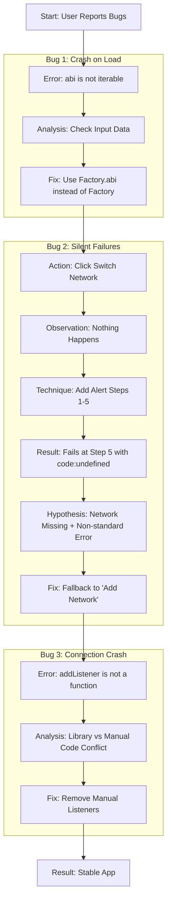

# Debugging Analysis: Network & Connection Issues

This document explains the series of errors we encountered, why they happened, and how we solved them. It includes a guide on **how to think like a debugger** so you can solve future issues on your own.

---

## 1. Visual History of Our Debugging Session

This diagram shows the timeline of problems we faced and the logic used to fix them.



---

## 2. The Detailed Analysis

### Problem A: The "Not Iterable" Crash
*   **Error**: `TypeError: abi is not iterable`
*   **Reason**: We gave a "Whole Book" (the JSON object) to a function that only wanted a "List of Chapters" (the ABI array).
*   **Fix**: We changed `Factory` to `Factory.abi`.

### Problem B: The Silent Network Failure
*   **Error**: `Failed to switch... Code: undefined`
*   **Reason**: Your wallet didn't know "Sepolia" existed, so it couldn't switch to it. The error code was missing, so our specific check `if (code == 4902)` was ignored.
*   **Fix**: We added a fallback: "If switching fails for *any* reason, assume the network is missing and try to ADD it."

### Problem C: The Listener Conflict
*   **Error**: `this[#x][e]?.addListener is not a function`
*   **Reason**: Two different parts of the code (our manual listeners and the Ethers.js library) were fighting to control the same wallet events.
*   **Fix**: We removed our manual listeners and let the library handle it.

---

## 3. The Debugger's Mindset: How to Think

When you hit a bug in the future, follow this mental framework.

### Phase 1: The "What" (Isolation)
*   **Don't Panic**: Read the error message carefully. It usually tells you exactly what is wrong, even if it uses scary words.
*   **Locate**: Where exactly did it stop?
    *   *Self-Question*: "Did the button click even register?"
    *   *Self-Question*: "Did the function start? Did it reach the middle?"
*   **Action**: Trace the steps. If you don't know where it stopped, force the code to tell you (using tools).

### Phase 2: The "Why" (Hypothesis)
*   **Check Inputs**: "I am calling Function X. Am I giving it the right data?" (This solved Bug 1).
*   **Check Environment**: "Is the external thing (Wallet/API) doing what I expect?" (This solved Bug 2).
*   **Simplify**: "Is my code too complex? Am I doing the same thing twice?" (This solved Bug 3).

### Phase 3: The "How" (Resolution)
*   **Iterate**: Fix one thing at a time.
*   **Verify**: After applying a fix, try to break it again. If you can't, it's fixed.

---

## 4. The Debugging Toolkit for Beginners

Here are the specific tools and techniques I used, which you can use too.

### Tool 1: The "Breadcrumb" Alerts (Best for logic flow)
When you aren't sure **where** code stops, verify it by adding alerts like breadcrumbs.
```javascript
alert("Step 1: Function started")
// ... some code ...
alert("Step 2: Database connected") // If you verify Step 1 but never see Step 2, the error is between them!
```

### Tool 2: The Console Log (Best for data inspection)
When you aren't sure **what** data you have.
```javascript
try {
  // code
} catch (error) {
  console.log("MY ERROR:", error) // Open F12 -> Console to see the full details object
  console.log("Variable:", myVariable) // Check if it's undefined
}
```

### Tool 3: The "Binary Search" (Simplification)
If a file has 100 lines and is crashing:
1.  Comment out the bottom 50 lines. Does it still crash?
2.  If yes, the error is in the top 50.
3.  If no, the error is in the bottom 50.
4.  Repeat until you find the exact line.

### Tool 4: The Fallback (Defensive Programming)
Always assume things will fail.
*   Instead of: "Switch Network"
*   Think: "Try to Switch Network. If that fails, Try to Add Network. If that fails, Tell the User."
