# 🚀 PumpedUp.fun

> **The ultimate decentralized launchpad for meme coins on the Sepolia Network.**  
> *Launch your token in seconds. Trade instantly. No liquidity required.*


---

## ⚡ Introduction

**PumpedUp.fun** is a fully decentralized platform that simplifies the chaos of token launches. Forget about liquidity pools, complex setups, and rug pulls.
With our **Bonding Curve** mechanism, every token starts with a fair price that increases as people buy. Once the funding target is hit, the token graduates!

**Why PumpedUp.fun?**
- **Instant Launch:** Create a token with a name and ticker in one click.
- **Fair Pricing:** Algorithmic pricing ensures early buyers get the best entry.
- **Bot Resistant:** No pre-sales, no sniper bots—just raw demand.

---

## 🔮 System Architecture

Below is the high-level flow of how **PumpedUp.fun** operates, designed for the modern web3 stack.

```mermaid
%%{init: {'theme': 'dark', 'themeVariables': { 'primaryColor': '#0f0', 'edgeLabelBackground':'#111', 'tertiaryColor': '#fff'}}}%%

graph TD
    classDef neon fill:#111,stroke:#0f0,stroke-width:2px,color:#fff,shadow:0 0 10px #0f0;
    classDef client fill:#222,stroke:#0cf,stroke-width:2px,color:#fff;
    classDef chain fill:#220022,stroke:#f0f,stroke-width:2px,color:#fff;

    subgraph UserSide [Client Side]
        User((👤 User))
        UI[💻 Next.js Frontend]:::client
        Wallet[🦊 MetaMask]:::client
    end

    subgraph Blockchain [Ethereum Sepolia]
        Factory[🏭 Factory Contract]:::neon
        T1[🪙 Token A]:::chain
        T2[🪙 Token B]:::chain
    end

    User -->|1. Connects| Wallet
    User -->|2. Creates/Buys| UI
    UI -->|3. Request Sign| Wallet
    Wallet -->|4. Submit Tx| Factory
    Factory -.->|Deploys| T1
    Factory -.->|Deploys| T2
    Factory -->|5. Mint/Transfer| User

    linkStyle 0 stroke:#0cf,stroke-width:2px;
    linkStyle 1 stroke:#0cf,stroke-width:2px;
    linkStyle 2 stroke:#0cf,stroke-width:2px;
    linkStyle 3 stroke:#0f0,stroke-width:2px,color:red;
```



---

## ✨ Key Features

### 🏭 Token Factory
The heart of the platform. A smart contract that allows anyone to deploy a standard ERC-20 token instantly.
- **Fee:** Small creation fee prevents spam.
- **Storage:** Tracks all deployed tokens and their sales states.

### 📈 Bonding Curve Trading
No Uniswap? No problem.
The Factory contract acts as the automated market maker (AMM).
- **Buy Logic:** Price increases linearly as supply is bought.
- **Target Cap:** Once ~3 ETH is raised (or 500k tokens sold), the bonding curve ends.

### 🔐 Safety First
- **Liquidity Lock:** (Simulated) Funds are secured until the target is hit.
- **Verification:** All contracts are verifiable on Etherscan.

---

## 🛠️ Technology Stack

- **Frontend:** Next.js 14, React, Ethers.js
- **Smart Contracts:** Solidity 0.8.27
- **Development Env:** Hardhat
- **Styling:** Custom CSS (Glassmorphism inspired)

---

## 🚀 Getting Started

Want to run this locally? Follow these steps.

### 1. Requirements
- Node.js (v18+)
- MetaMask (Browser Extension)
- Alchemy/Infura API Key (for Sepolia)

### 2. Installation
```bash
git clone https://github.com/Anshuman-Jha/pumpedup.fun.git
cd pumpedup.fun
npm install
```

### 3. Smart Contract Setup
Create a `.env` file in the root:
```env
SEPOLIA_RPC_URL=https://eth-sepolia.g.alchemy.com/v2/YOUR_KEY
PRIVATE_KEY=YOUR_WALLET_PRIVATE_KEY
```

Deploy the contracts to Sepolia:
```bash
npx hardhat ignition deploy ignition/modules/Factory.js --network sepolia
```

### 4. Running Frontend
Update `app/config.json` with your new contract address if you redeployed.

```bash
npm run dev
```
Visit `http://localhost:3000` and start pumping!

---

## 🤝 Contributing
Open to PRs! If you want to add selling features, enhanced UI, or multi-chain support, feel free to fork.

---

*Verified on Sepolia Network* 🟢